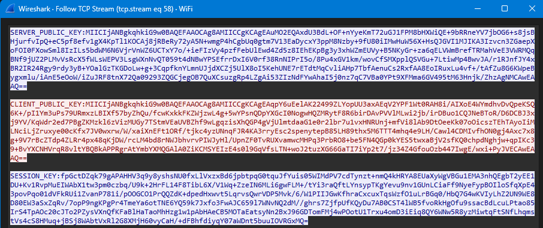

# SecureChat - Application de Messagerie Sécurisée

Application de messagerie instantanée développée en Java avec chiffrement de bout en bout.
IP public pour tester le serveur: 54.242.210.193

## Équipe
- **Laaraich Lina**
- **El Kanich Fatima Ezzahra**
- **Boumous Oumayma** 
- **El Moussaoui Safae**

*Projet supervisé par: Professeur M. Ahmed Bentajer*

## Architecture de Sécurité

### Protocole de Chiffrement Hybride
Notre application utilise une approche hybride combinant cryptographie asymétrique et symétrique:

```
1. Échange de clés (RSA-4096)
   ├── Le serveur génère une paire de clés RSA
   ├── Le client génère sa propre paire de clés RSA
   ├── Échange des clés publiques via TCP
   └── La clé AES est chiffrée avec RSA puis transmise

2. Communication sécurisée (AES-256)
   ├── Tous les messages sont chiffrés avec AES-256-GCM
   ├── Chaque message a un IV unique
   └── Intégrité vérifiée par HMAC-SHA256
```

### Schéma d'Échange de Clés

```
Client                     Serveur
  |                           |
  |-------- Connexion ------->|
  |                           |
  |<--- Clé Publique RSA -----|
  |                           |
  |---- Clé Publique RSA ---->|
  |                           |
  |<-- Clé Session AES -------|
  |    (chiffrée avec RSA)    |
  |                           |
  |===== Communication =======|
  |     Sécurisée (AES)       |
```

## Structure du Projet

```
SecureChat/
└── src/
    ├── client/
    │   └── SecureChatClient.java
    ├── server/
    │   └── SecureChatServer.java
    ├── common/
    │   ├── CryptoUtils.java
    │   └── Message.java
    └── security/
        ├── KeyStoreManager.java
        ├── KeyRotationManager.java
        ├── MessageIntegrity.java
        ├── NonceManager.java
        └── RateLimiter.java
```

## Analyse Wireshark
Nous avons analysé le trafic réseau avec Wireshark pour vérifier la sécurité de notre implémentation:

### Captures d'écran

**Vue d’ensemble des paquets entrants pendant une session chat**

*Analyse du trafic réseau avec Wireshark : capture et détails d’un paquet TCP.*

**Échange de clés RSA:**

*La clé publique RSA est transmise à chaque nouveau client connecté. Cette clé est visible dans Wireshark (ce qui est normal, car elle est publique). La même clé publique est envoyée à tous les clients, comme requis pour le chiffrement RSA.*

**Messages chiffrés:**

*Les messages sont chiffrés en AES, tandis que certaines informations de session non sensibles restent en clair. Tous les messages sont correctement protégés par AES.*

**Déploiement AWS EC2**

*Le serveur est configuré comme service pour un fonctionnement continu et stable.*

##  Points de Sécurité Importants

### Comment partager une clé secrète sur un canal non sécurisé?

**Notre solution:** Cryptographie hybride
   - Le serveur génère une clé AES-256 (pour chiffrer les messages)
   - Cette clé est chiffrée avec la clé publique RSA du client
   - Seul le client peut la déchiffrer avec sa clé privée RSA
   - Même si un attaquant intercepte la transmission, il ne peut pas déchiffrer sans la clé privée
